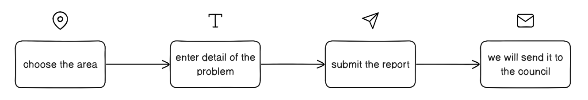
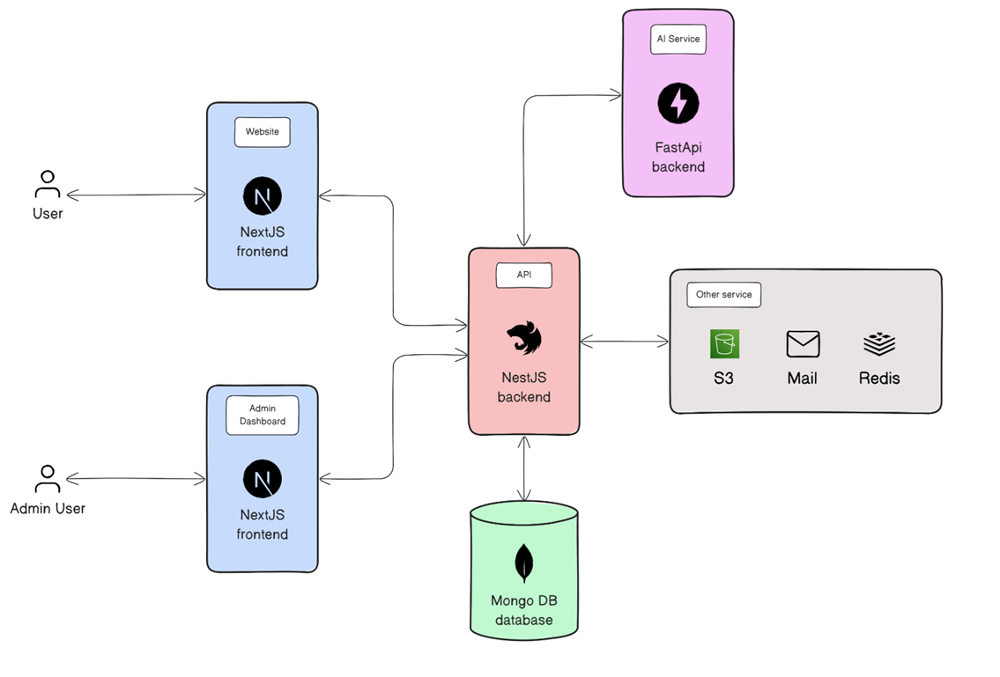
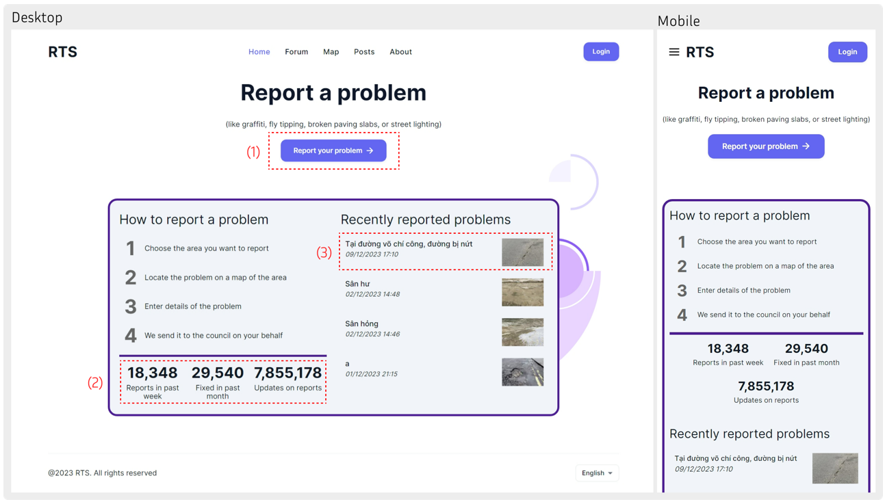
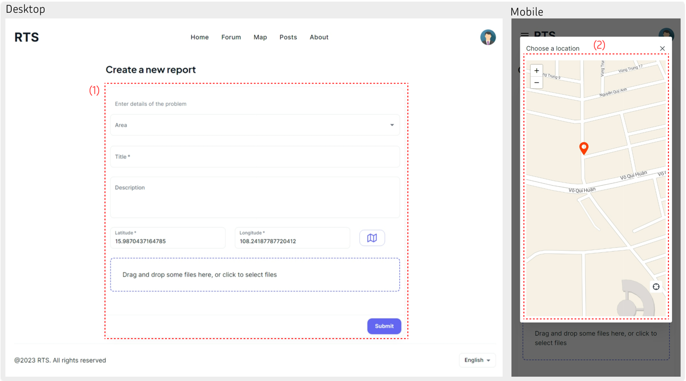
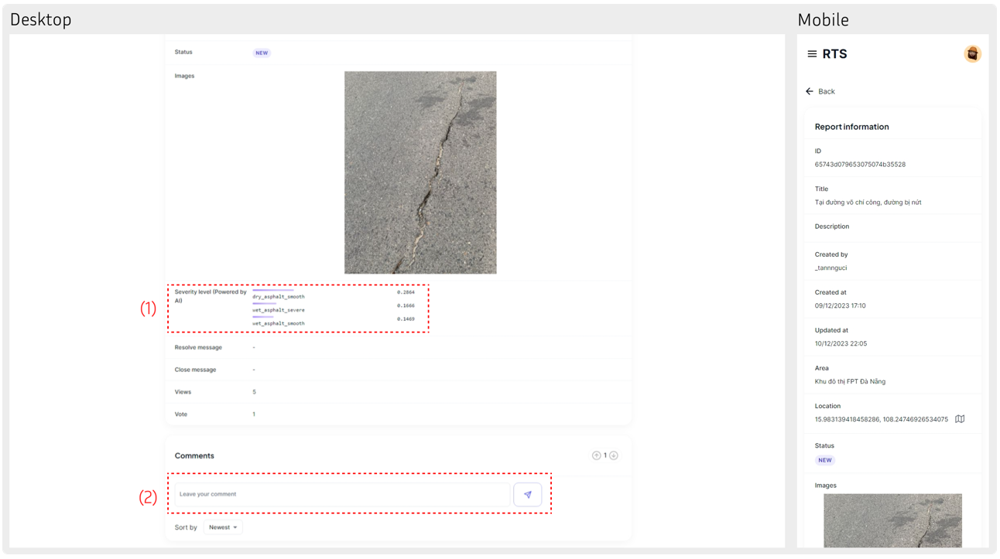
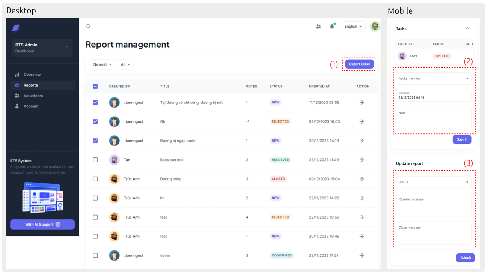
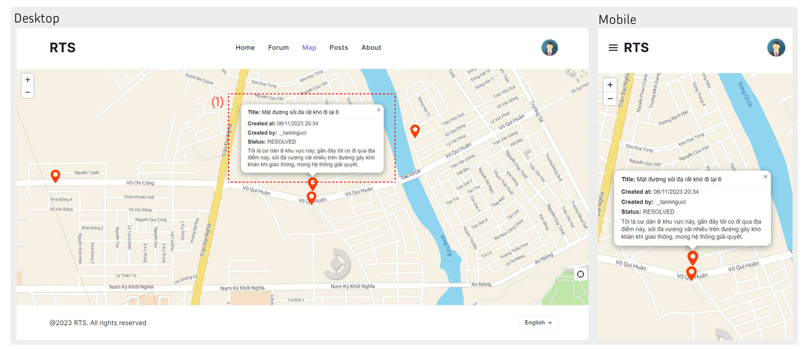

# Road Traffic Safety (RTS)

### Description:

A system to assist in the evaluation and repair of road surface problems

Technologies: NestJS, NextJS, MongoDB, Redis, Computer Vision (Res-net 50), FastAPI

I build a web application that allows residents to send feedback with area, images, locations, title and descriptions

An AI-based system that automatically classifies the severity level of the reported damages

After the reports have been verified, we can aggregate the reports and forward them to the relevant authorities for resolution

### Repositories:

- [NestJs backend ](https://github.com/nt4rever/hmmmm)
- [AI backend](https://github.com/nt4rever/ai-rts)
- [NextJs user page](https://github.com/nt4rever/rts)
- [NextJs admin page](https://github.com/nt4rever/admin-rts)