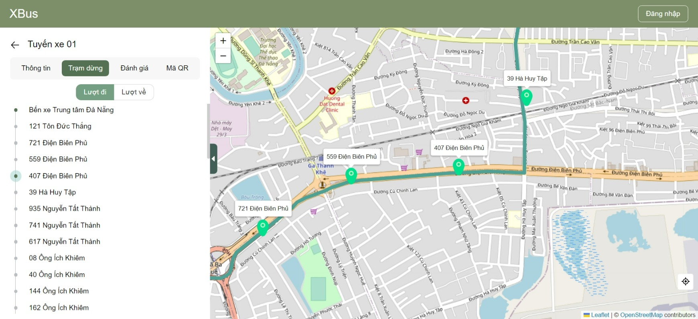

# XBus

### Description:

I created a website and Android application to help citizens easily locate buses, with the goal of boosting public transportation usage by offering a user-friendly, accessible platform

Technologies: NestJS, React, Kotlin, MongoDB, Firebase, Open Street Map

### Repositories:

- React web page: https://github.com/nt4rever/xbus-react
- NestJs backend: https://github.com/nt4rever/xbus-nest
- Android app for citizen: https://github.com/nt4rever/xbus
- Android app for bus driver: https://github.com/nt4rever/xbusdrive